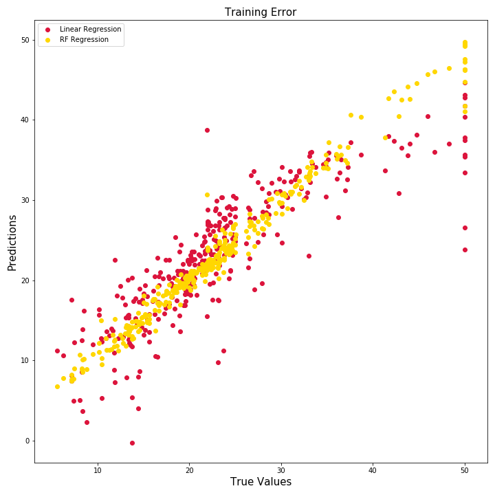
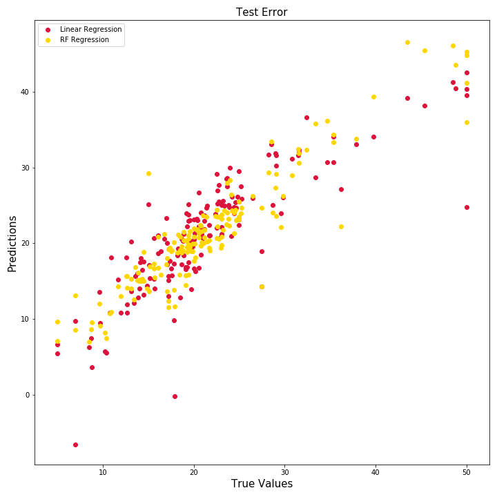

# SKLearn Housing Tutorial
Basic introduction to linear ML methods using the sklearn Boston housing dataset.

Notebooks will create and analyze the Boston Housing data with sklearn. 

Currently implements linear regression and random forest regressor. 

## Repo Goals

By completing these notebooks, you should be able to understand how to run regression models in sklearn, visualize results, compare models and select the best performing one using a given metric. 

Notebooks rely on pandas, sklearn, joblib, matplotlib and seaborn libraries.

## Notebooks Overview

1. 1_Generate_Data
    * Imports data from sklearn
    * Saves data to csv files in 'data' dir
    * Has notes on environment setup (i.e., package versions) to complement the yml in the 'environment' dir
1. 2_Train_Test_Split
    * Imports data using pandas from csv files
    * Uses sklearn train-test split to create training and test datasets
    * Saves split data back into csvs in 'data' dir
1. 3_EDA
    * Imports training data only to conduct exploratory data analysis (EDA)
    * Visualizes data with seaborn pairplot
    * Has a method to explore column level data including number of unique values and value counts
1. 4_Train_Models
    * Trains two models on training data
        * Linear Regression
        * Random Forest Regressor
    * Saves models using joblib to file
    * Calculates performance on training data by visualizing errors and mean squared error calculation
1. 5_Predict_and_Evaluate
    * Loads trained models and test data
    * Runs predictions on test data
    * Evaluates performance by:
        * Visualizing prediction error
        * Mean squared error metric
        * Explained variance score metric

## Example Results

The two plots below show predicted vs. actual values for the train and test dataset for both models tested. The crimson dots represent the linear regression and the gold dots the random forest regressor. 

### Training Error Plot

### Test Error Plot

